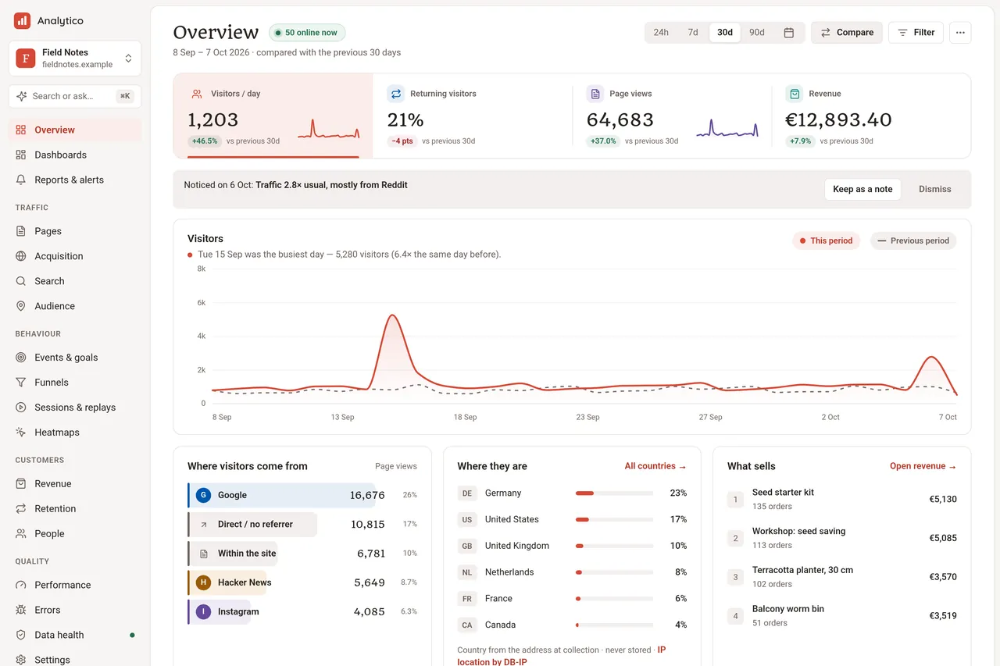
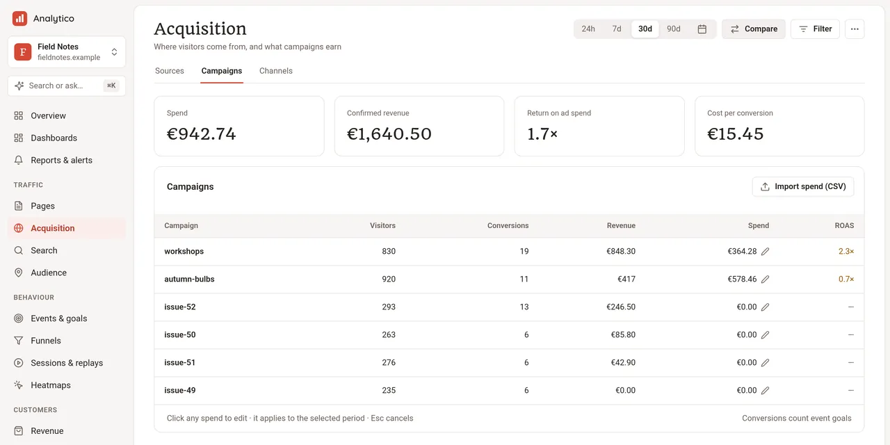
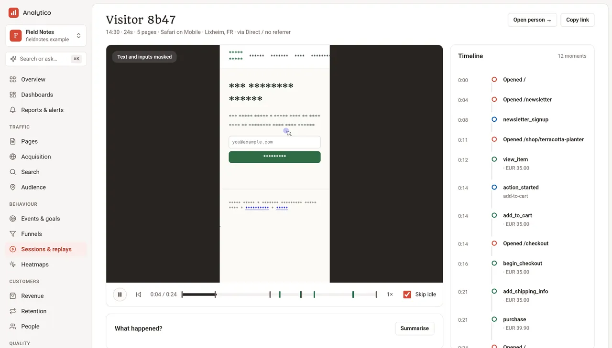
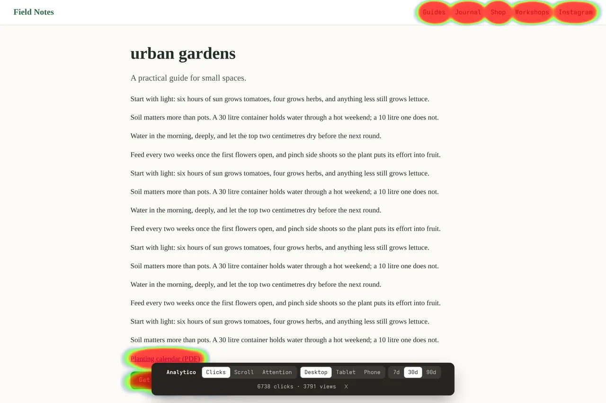
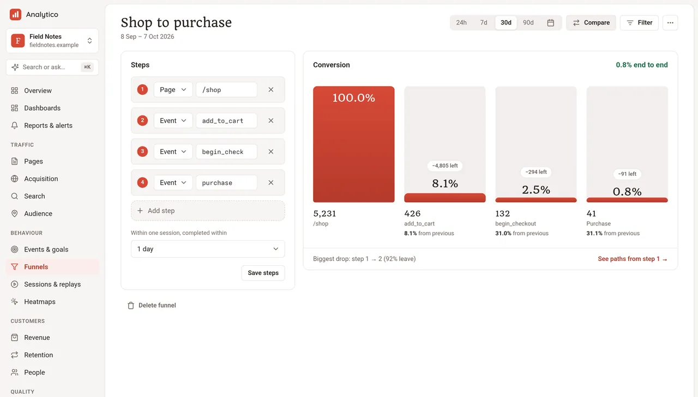
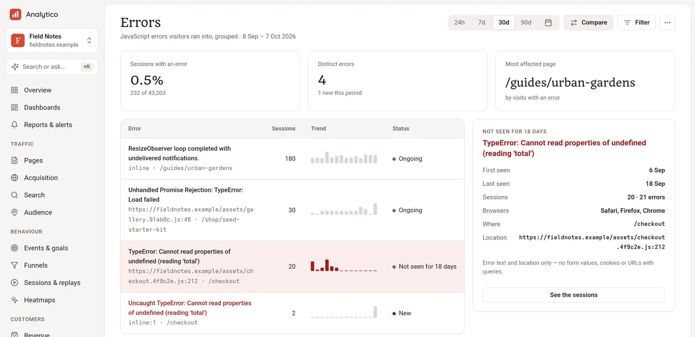
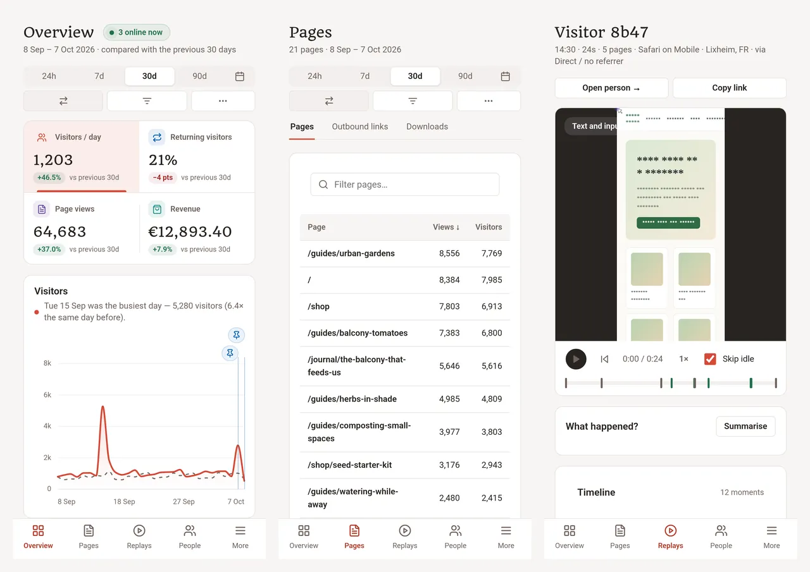

# Analytico

Self-hosted analytics for websites, shops and products. One Linux
executable that keeps everything in SQLite on its own disk: no database
server, no queue, no third-party scripts on your pages.

Each website chooses how much it remembers about a visitor, and the
server enforces the choice. In **Lite** mode the tracker stores nothing
in the visitor's browser. In **Full** mode a visitor is remembered only
once they agree, or where the law doesn't ask.



[What it answers](#what-it-answers) ·
[Three modes](#three-modes) ·
[Run it](#run-it) ·
[How it works](#how-it-works) ·
[Numbers](#numbers) ·
[Why you might not want it](#why-you-might-not-want-it) ·
[Docs](#docs)

## What it answers

**For a website:** how many people came and from where (search, social,
newsletters, AI assistants, campaigns), what they read and how far they
scrolled, what they searched for on the site, which links and files they
followed, which countries and devices, and whether the site got slower
with the last release (Core Web Vitals from real visits).

**For a shop or a product:** which campaign and which ad brought a
visit and what it earned (with your ad spend, return on it), where
checkout and forms lose people and on which field, which JavaScript
errors and rage clicks got in the way and what that looked like in a
masked session replay, where people click on a page, who comes back, and
one customer's journey across devices.

Everything is a page in the workspace, a command (`analytico report …`),
a read API endpoint and a tool for an AI assistant: the same report
catalog behind all four.

<table>
<tr>
<td width="50%"><br><sub>Campaigns, with spend imported from Google Ads and Meta or a CSV.</sub></td>
<td width="50%"><br><sub>A replay: text and inputs masked in the browser, before anything is sent.</sub></td>
</tr>
<tr>
<td><br><sub>Heatmaps drawn over the live page, from per-element click cells.</sub></td>
<td><br><sub>Funnels from pages, events and goals, inside one visit.</sub></td>
</tr>
<tr>
<td><br><sub>Errors grouped by message, with when they started and in which browsers.</sub></td>
<td><br><sub>The whole workspace works on a phone.</sub></td>
</tr>
</table>

The screenshots show a demo shop with 88 days of generated traffic and a
morning of real browser visits. [docs/TOUR.md](docs/TOUR.md) walks through
every screen.

## Three modes

Each website picks one. You can change it later; the data already
collected stays.

| | Lite | Session | Full (default) |
|---|---|---|---|
| Stored in the browser | nothing | a random ID in `sessionStorage`, gone when the tab closes | after consent: a visitor ID and a 30-minute session in `localStorage` |
| Consent banner | not needed | usually not needed | asked where your policy says (EU, UK and Switzerland by default); everyone else is counted as Lite until then |
| You get | page views, sources and campaigns, places, devices, engagement, errors, Web Vitals, a per-day visitor count | plus visits: paths, funnels, landing and exit pages, rage clicks | plus returning visitors and retention, people and revenue per person, replays, heatmaps, form analytics, visits across your own domains |

In every mode the IP address is used once, for the country and a per-day
pseudonym, and never stored. Global Privacy Control and Do Not Track keep
a visitor in Lite. Anyone can be erased: by you, by your backend through
the API, or by the visitor with `analytico.forget()`.

## Run it

You need Linux, Zig 0.17 (the exact version is in `.zigversion`) and a
reverse proxy such as Caddy in front.

```sh
zig build -Doptimize=ReleaseSafe                        # zig-out/bin/analytico
analytico init ./data --origin https://analytics.example.com
analytico site add shop https://shop.example.com --data ./data
analytico site snippet shop https://analytics.example.com --data ./data
analytico serve --data ./data --listen 127.0.0.1:4318
```

`init` prints a one-time link to create your account with a passkey.
Paste the snippet into your site's `<head>`; the setup page confirms when
the first visit arrives. Optionally install the free DB-IP Lite database
for countries and cities: `analytico geo import dbip-city-lite.csv.gz`.

[deploy/](deploy/) has the Caddy configuration and a systemd unit;
[docs/OPERATIONS.md](docs/OPERATIONS.md) covers upgrades, backups,
retention and restores.

## How it works

```
 your pages ── tracker (5–10 KB) ──▶ POST /e ─┐
                                              ├─▶ collector ─▶ analytico.db (SQLite, WAL)
 your server ── signed events ─────▶ POST /i ─┘        │            │
                                                        │      daily rollups
 consented visits ─ masked replay chunks ─▶ POST /r ─▶ replays.db   │
                                                                     ▼
                         workspace (HTML)  ·  CLI  ·  read API  ·  MCP for AI assistants
```

- **One process owns writes.** Batches that arrive together are committed
  together, so concurrent visitors share one disk sync; a bad batch rolls
  back alone. Reads use their own connections.
- **Rollups, not sampling.** Each closed day is summarised once per
  dimension; today is summarised up to a cut 30 seconds behind the clock,
  and reports read the summaries plus the raw rows after the cut. Raw
  events stay the source of truth.
- **The workspace is server-rendered HTML** with one small script for
  instant navigation, live updates and keyboard shortcuts. No build step,
  no client framework.
- **Your backend reports what the browser can't be trusted with:**
  confirmed payments, refunds, sign-ups, signed with a per-site secret.
  An order seen from both sides counts once, and the server's copy wins.
- **AI is optional and narrow.** Ask a question in plain words, get
  "why did this day change?", describe a filter, summarise a session. It
  runs on your own ChatGPT plan, an Anthropic or OpenAI key, or any
  OpenAI-compatible endpoint (a local model works). Only aggregates are
  sent, and every call is logged with what was sent. Claude and ChatGPT
  can also read your reports through the read-only MCP connector.

[PRODUCT.md](PRODUCT.md) describes every feature;
[docs/PROTOCOL.md](docs/PROTOCOL.md) the collection protocol.

## Numbers

Measured with [tests/load.mjs](tests/load.mjs) and the [tour](docs/TOUR.md)
on a shared 8-vCPU virtual machine (AMD EPYC 9354P, 32 GB of RAM, btrfs on
SSD), ReleaseSafe build, 7 October 2026:

| | |
|---|---|
| Ingest | 290–450 batches a second from 32 concurrent clients, p50 57–100 ms; bound by the disk sync, which other services on this machine share |
| Workspace, 66,000 page views a month | median page 29 ms on the server; slowest, Paths, 955 ms |
| Workspace, 2.5 million page views a month | Pages, Audience, People, Events and the read API under 450 ms; Overview 0.9 s; Campaigns 2.8 s; Sessions 3 s; Retention 11 s; Revenue 16 s; Errors and Paths about 28 s; Performance over 30 s |
| Tracker, gzipped | Lite 5.2 KB · Session 5.9 KB · Full 10.4 KB (+0.4 KB with Web Vitals); the replay recorder, 25 KB, loads only for sessions that record |
| Executable | 27 MB, SQLite compiled in |

## Why you might not want it

- **It runs on Linux only**, as one process on one machine. There is no
  cluster mode and no hosted version.
- **Big sites are slow in places.** Several reports still count raw page
  views: above a few hundred thousand page views a month, Paths, Errors,
  Revenue, Retention and Performance take seconds, and at 2.5 million some
  take half a minute (see [Numbers](#numbers)).
- **It is young.** Built in 2026 by one person, used on a handful of
  sites. Upgrades migrate the database after a backup, but there is no
  long-term support release.
- **The tracker is bigger than the smallest ones** (Plausible's is under
  1 KB) because it measures engagement, sections, errors and forms on
  every page.
- **Full mode needs a consent banner** where the law asks for one. The
  built-in banner is small and has two equal buttons, but it is a banner.
- **Integrations are few:** Google Search Console, GA4 history import,
  Google Ads, Meta, Slack, webhooks and a nightly CSV export.

## Development

```sh
npm ci                                    # browser driver and axe-core, for tests
zig build test -Doptimize=ReleaseSafe     # unit checks
zig build e2e -Doptimize=ReleaseSafe      # every journey, in a real browser
```

The end-to-end journeys in [tests/](tests/) run the real executable
against disposable SQLite data and loopback HTTP, with stand-ins for
Google, Meta, Slack, OpenAI and Anthropic. They cover collection and
every catalog report, the three tracking modes in Chromium, consent,
replays, heatmaps, roles, public links, the API, AI sign-in and Ask,
the workspace's speed features, and hostile HTTP clients. Chromium
defaults to `/usr/bin/chromium` (`CHROMIUM_PATH` changes it).

Two more are run by hand before a release: [tests/load.mjs](tests/load.mjs)
for the numbers above, and [tests/tour.mjs](tests/tour.mjs), which fills a
demo shop with three months of traffic and goes through all 77 screens with
screenshots, an accessibility check and the server's timing for each
([docs/TOUR.md](docs/TOUR.md)).

## Docs

[PRODUCT.md](PRODUCT.md) · [docs/OPERATIONS.md](docs/OPERATIONS.md) ·
[docs/PROTOCOL.md](docs/PROTOCOL.md) · [docs/TOUR.md](docs/TOUR.md) ·
[AGENTS.md](AGENTS.md) (how the code is meant to stay)

MIT licensed. IP location by [DB-IP](https://db-ip.com) (CC BY 4.0) when
installed; replays by [rrweb](https://github.com/rrweb-io/rrweb) (MIT).
