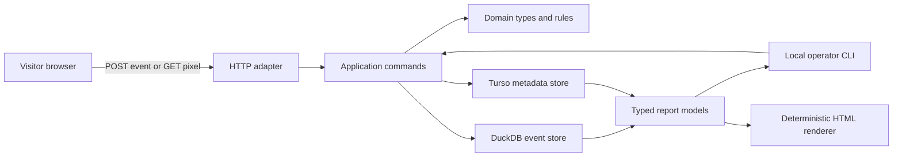

# Architecture

## 1. Runtime shape



The deployed MVP has one operating-system process and two local database files.
Turso and DuckDB are linked libraries, not services. Caddy terminates TLS,
exposes only documented collection routes on the public hostname, and protects
the separate private dashboard hostname with Basic Auth.

## 2. Dependency direction

```text
domain
  ↑
application
  ↑
adapters: cli, http, turso, duckdb
  ↑
composition root

renderer <- typed view models <- controller <- application
```

- Domain code knows plain Zig types, validation rules, and metric semantics.
- Application code coordinates explicit operations and owns timeouts.
- Adapters translate CLI, HTTP, Turso, and DuckDB details.
- The composition root creates concrete handles and passes them directly.
- There is no service locator, dependency-injection container, ORM, generic
  repository framework, or generic middleware chain.

An interface is introduced only when a second real implementation or a
deterministic test seam needs the same semantics. Until then, functions accept
the concrete store or a narrow function pointer owned by the caller.

## 3. Source layout

This is a destination, not permission to create empty placeholder modules:

```text
src/
  domain/             event, site, goal, funnel, range, validation
  app/                ingest, report, administration, backup
  store/turso/        metadata connection and numbered migrations
  store/duckdb/       C bridge, event schema, inserts, report SQL
  cli/                command parsing and terminal/JSON/CSV output
  http/               collector routes, origin checks, rate limits
  tracker/            source used to produce the small vendored tracker
  web/                dashboard adapter, controller, view models, renderer
  main.zig            composition root
```

A folder is created only when its first concrete module is implemented.

## 4. Database responsibilities

### Turso

Turso contains relational state with small cardinality and ordinary
transactions:

- site identity and allowed origins;
- goal and funnel definitions;
- allowlisted custom properties;
- database migration ledger.

Remote synchronization, encryption, FTS, and Cloud access remain disabled until
a separately accepted requirement needs them.

### DuckDB

DuckDB contains:

- one append-oriented event table;
- its own migration ledger;
- report SQL over bounded site and time filters.

The serving process configures one query thread, a bounded memory limit, a
bounded temporary directory, no community extensions, and no external file or
network access. It never executes request-supplied SQL.

### No cross-database transaction

No user action requires atomic writes to both files:

- site/goal/funnel administration writes only Turso;
- event ingestion reads already-loaded site policy and writes only DuckDB;
- reporting reads immutable configuration and event snapshots.

If a goal changes while a report runs, that report uses the owned goal snapshot
loaded at its start. This is deterministic and avoids pretending the two files
offer distributed transactions.

## 5. Collection flow

1. The HTTP adapter rejects an oversized request before allocation.
2. It resolves the site by public identifier from a bounded in-memory snapshot
   populated from Turso at startup and refreshed only by an explicit local
   administration operation or process restart.
3. It validates the exact `Origin` or request referrer origin.
4. It parses a bounded payload into a domain `IncomingEvent`.
5. Domain normalization removes arbitrary query strings, canonicalizes the
   path and referral host, validates the event name and allowlisted properties,
   and derives coarse dimensions.
6. A keyed daily pseudonym is derived from site, UTC date, normalized network
   prefix, and coarse user-agent input. Raw inputs are then discarded.
7. The DuckDB adapter inserts one event in a short transaction.
8. Only after commit does the adapter return success.

At the target traffic level, direct durable inserts are simpler and more honest
than an in-memory queue. A queue is reconsidered only after measured write
latency violates the budget.

## 6. Report flow

1. Parse and validate site, UTC range, pagination, filters, and report kind.
2. Load the site and any goal/funnel definition from Turso with an application
   timeout.
3. Build one of a closed set of report query plans.
4. Bind all data values and execute on DuckDB with a deadline and interrupt.
5. Decode into an owned typed report.
6. Render table, JSON, or CSV in the CLI, or deterministic HTML from the same
   report type in the dashboard.

No report accepts arbitrary SQL, column names, sort expressions, or templates
from the request. Enumerated sorts select a compiled query template.

## 7. Concurrency

- Exactly one process opens the DuckDB file read-write.
- The process owns a small fixed set of connections.
- Appends and reports may run in the same process; report concurrency is
  bounded.
- The collector never starts an unbounded task per request.
- Shutdown stops accepting requests, waits for a bounded grace period,
  interrupts remaining reports, checkpoints, and closes both stores.

DuckDB supports concurrent appends within one process, but that capability is
not a reason to add a worker pool before load requires it.

## 8. Failure behavior

| Failure | Required behavior |
| --- | --- |
| Invalid or oversized event | Reject before storage; bounded log counter |
| Unknown/disabled site | Reject without revealing site details |
| Country/client cannot be derived | Store `unknown`; accept otherwise valid event |
| DuckDB write fails | Return failure; never claim acceptance |
| Report exceeds deadline | Interrupt query and return an honest timeout |
| Turso unavailable/corrupt | Readiness fails; administration/reporting unavailable |
| DuckDB unavailable/corrupt | Readiness fails; collection and reports unavailable |
| Disk full | Reject writes, expose readiness failure, preserve existing files |
| Renderer error | Return a small escaped server-rendered error page |

## 9. Caching

The MVP has no report cache. The expected dataset makes on-demand queries the
simpler choice. M6 did not add a cache because measurements did not require
one. Any later cache key must include site, exact time
range, metric-version, filters, sort, and page; its invalidation watermark is
the latest accepted event time for that site.

## 10. Later UI and Cloudio

DuckDB's writable-file ownership rules prohibit a later Cloudio process from
opening the same file concurrently. The supported candidates are:

1. Keep Analytico standalone and link to its server-rendered dashboard.
2. Compile the Analytico application modules into Cloudio so Cloudio becomes
   the one process that owns both stores.
3. Have Cloudio request complete HTML from Analytico with a strict timeout,
   while Analytico remains the database owner.

The choice is deferred to M8 and must be based on a real UI integration. The
MVP does not create a generic API or shared package in anticipation.
