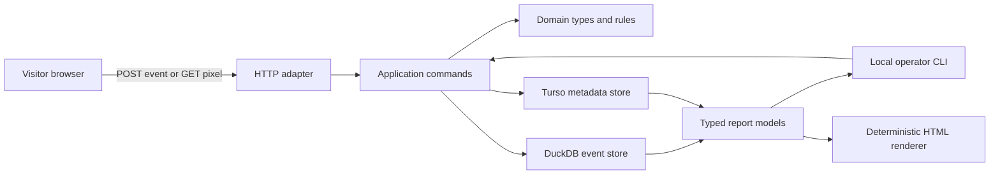

# Architecture

> **Status:** Sections 1–10 describe the shipped one-process runtime, its frozen
> protocol-v1 compatibility path, additive protocol-v2 collector foundation,
> event schema 7, metadata schema 10, protocol-v2 tracker anonymous identity,
> and 30-minute client sessions. The remaining 1.0 evolution is stated
> separately below; it preserves this runtime shape and lands only with its
> issue evidence.

## 1. Runtime shape



The deployed MVP has one operating-system process and two local database files.
Turso and DuckDB are linked libraries, not services. Caddy terminates TLS,
exposes only documented collection and `/admin` routes on one canonical
hostname, redirects `/` to `/admin`, and rejects every unknown path. Analytico
protects dashboard state with its server-side passkey session.

## 2. Dependency direction

```text
domain
  ↑
application
  ↑
adapters: cli, http, turso, duckdb
  ↑
composition root

renderer <- typed view models <- controller <- application
```

- Domain code knows plain Zig types, validation rules, and metric semantics.
- Application code coordinates explicit operations and owns timeouts.
- Adapters translate CLI, HTTP, Turso, and DuckDB details.
- The composition root creates concrete handles and passes them directly.
- There is no service locator, dependency-injection container, ORM, generic
  repository framework, or generic middleware chain.

The web adapter recognizes a closed set of canonical
`/admin/sites/{site}/...` destinations and passes a destination plus validated
query state to one controller/view-model/renderer path. Every destination
returns a complete semantic document. The bounded legacy `/admin?...` parser
only translates known shipped report state and redirects; it is not a second
application state model. Shell-only destinations do not run an analytics query
merely to render navigation and context.

Shared calendar state is likewise server-owned. Raw bounded GET fields are
parsed before site selection; the controller then finalizes missing defaults
against the selected site's startup-validated timezone and one server clock
sample. A pure calendar module resolves presets, comparison dates, current-day
incompleteness, and D27 half-open UTC bounds. The server passes the already
loaded site timezone through one narrow lookup; renderers receive only the
resolved typed view model and perform no clock, database, or filesystem work.
Preset links and custom/comparison forms target the same canonical routes, so
HTMX history enhances ordinary browser history instead of creating another
calendar state.

The authenticated onboarding adapter follows the same boundary. It renders a
typed no-site state, accepts one bounded native create form, and redirects to a
site-scoped Install destination. Validation and canonicalization finish before
metadata I/O. The metadata adapter follows D19 durable autocommits and explicit
compensation; only after the complete stored outcome does the composition root
replace the in-memory collection-policy snapshot. No JavaScript state, API
refetch, or database call enters the renderer.

D38 completes the Install destination without a third durable state store. A
bare authenticated GET samples the selected site's row count and latest
compound DuckDB event position, then issues session-bound HMAC-signed URL
fields. Full GET and
the optional bounded verification fragment load the first committed event after
that position plus one safe selected-site, restart-scoped diagnostic outcome.
The dedicated Install script owns only copy and visible/unpaused five-second
refresh; the same typed model and normal GET remain authoritative with
JavaScript disabled. No tracker configuration request, client router, cache,
background process, or renderer I/O is introduced.

An interface is introduced only when a second real implementation or a
deterministic test seam needs the same semantics. Until then, functions accept
the concrete store or a narrow function pointer owned by the caller.

## 3. Source layout

This is a destination, not permission to create empty placeholder modules:

```text
src/
  domain/             event, site, goal, funnel, range, validation
  app/                ingest, report, administration, backup
  store/turso/        metadata connection and numbered migrations
  store/duckdb/       C bridge, event schema, inserts, report SQL
  cli/                command parsing and terminal/JSON/CSV output
  http/               collector routes, origin checks, rate limits
  tracker/            source used to produce the small vendored tracker
  web/                dashboard adapter, controller, view models, renderer
  main.zig            composition root
```

A folder is created only when its first concrete module is implemented.

## 4. Database responsibilities

### Turso

Turso contains relational state with small cardinality. Multi-write operations
follow D19 durable autocommits and explicit compensation on the pinned engine:

- site identity and allowed origins;
- goal and funnel definitions;
- protocol-v1 custom-property allowlists;
- passkey credentials and revocable owner sessions;
- database migration ledger.

Remote synchronization, encryption, FTS, and Cloud access remain disabled until
a separately accepted requirement needs them.

### DuckDB

The shipped DuckDB schema contains:

- one append-oriented event table;
- the protocol-v2 anonymous-identity link table;
- its own migration ledger;
- report SQL over bounded site and time filters.

Event schema 3 adds the accepted protocol-v2 event and identity-link foundation
through the same DuckDB ownership boundary. It does not move configuration into
DuckDB or permit Turso to query analytics rows. Temporary visitor-day columns
keep metric-v1 report SQL honest until versioned metric-v2 queries replace it.
Event schema 4 added D31's temporary stored exclusion source. Event schema 5
consumes that source into the permanent D32 traffic class, classifier version,
and bounded rule and retains one release-only legacy verdict for comparison.
Event schema 6 adds D33's closed browser/receipt evidence, removes the completed
shadow byte, and promotes permanent class eligibility without a new store.
Event schema 7 adds D34's keyed site/receipt-day network-prefix pseudonym. It is
the only new event fact needed for durable identity-mint warnings; query-time
suspected verdicts remain derived and never rewrite the append-oriented rows.
Metadata schema 5 introduced the per-site strict flag and daily accepted-event
cap. Metadata schema 6 adds D36's one-to-one explicit default currency and
unique origin ownership. Metadata schema 7 adds D40's exact site-owned segments
and saved views without changing collection or event facts. Metadata schema 8
adds D41's replacement goal definitions with stable active/archive lifecycle,
created/updated state, and single-statement mutations. Metadata schema 9
replaces that table once with D42's canonical predicate-set document. The
controller resolves the complete selector before DuckDB; Turso still never
queries event rows and DuckDB never reads metadata.

Metadata schema 10 replaces the legacy funnel parent/step rows with D43's one
canonical bounded definition row. The plain funnel domain owns exact
serialization and validation without I/O. The controller resolves Goal steps
to complete D42 selectors and passes only owned selectors to DuckDB; stale
references never become partial queries.

Decision D29 adds a parallel pure `AnalysisQuery` model and finite metric-v2
store compiler. The domain model validates and canonicalizes state without I/O;
the store chooses only enum-reviewed fragments and binds every value. Current
metric-v1 report SQL/output remains intact, and specialized journey/session
queries retain their own result types. `ANALYSIS_QUERY.md` defines the exact
grammar, limits, serialization, compilation, and result boundary.

Decision D37 adds one bounded browser Trend-set envelope without changing the
single-query compiler. It materializes one through three ordinary Trend
queries, executes them sequentially under one shared interrupt budget, and
shares only the set's identical empty-filter identity coverage. It returns
owned typed results to the server renderer. Bare Analyze and the known
Overview point handoff use that metric-v2 path. Explicit metric-v1 `report=`
list URLs remain accepted only as one-redirect compatibility inputs. Decision
D39 makes the #29 Breakdown route render one ordinary D29 query directly,
including one bound aggregate-label search. Its bounded site-local property
catalog samples the latest 2,000 eligible custom events and shares one
interrupt budget with the exact result. D39 permits one site/range/policy/goal-
keyed sampled-catalog entry for 30 seconds, but no result cache, second query
model, projection, migration, or frontend data request. The old
combined campaign tuple redirects visibly to the canonical UTM-campaign
dimension, while explicit legacy UTM fields map exactly.

D40 makes the controller the only cross-store coordinator for saved analytical
state. It loads exact canonical FilterSet/Trend/Breakdown JSON from Turso,
validates the selected site and current property/goal catalog, composes segment
and ad-hoc clauses, and passes only the owned resolved FilterSet to DuckDB.
Overview, Trend, and Breakdown therefore share one visible context without
Turso querying events or DuckDB reading configuration. The server renderer
receives owned chip/action URLs and never parses state or performs I/O. The one
D35 Overview cache entry keys the complete composed set; no ordinary result
cache, client state store, background process, or new service is introduced.

D41 keeps goal management inside the same boundaries. Turso owns the stable
definition and archive state. The controller loads either the bounded active
snapshot or at most three explicitly selected goal IDs before analysis; DuckDB
never resolves a goal ID. A separate finite discovery statement returns Page
or custom-event labels, eligible count, and last receipt time under the current
site/range/policy deadline. Discovery remains local to the goal builder. D43's
funnel preview instead consumes already resolved selectors through its distinct
single availability statement; it does not reuse or broaden discovery. The
renderer receives one owned typed list/new/detail/edit model and performs no
I/O or allocation.

D43 applies the same boundary to funnel management. Turso owns stable
definitions and lifecycle state; one row contains the complete ordered draft.
The controller owns stable list/new/detail/edit routes, resolves shared filter
context and Goal references, and executes the specialized D43 availability and
D44 ordered-result plans under one request deadline. D44 numbers the filtered
meaningful DuckDB relation and follows at most eight reviewed next-position
links from every step-one occurrence. Session and persistent-person keys stay
inside DuckDB; only bounded counts, medians, and identity-coverage totals cross
the store boundary. Current and comparison runs are independent inputs to one
owned result. The renderer receives owned step labels, settings, counts,
errors, and action URLs. It does not parse canonical JSON, resolve a goal,
compute progression, or receive participant IDs.
The full-draft `/admin/funnels` and `/admin/funnels/edit` POST routes reuse
D40's exact 65,536-byte request/Caddy boundary because URL form encoding can
expand the bounded canonical document; all other funnel actions retain the
ordinary 8 KiB request ceiling.

The serving process configures one query thread, a bounded memory limit, a
bounded temporary directory, no community extensions, and no external file or
network access. It never executes request-supplied SQL.

### No cross-database transaction

No user action requires atomic writes to both files:

- site/goal/funnel administration writes only Turso;
- event ingestion reads already-loaded site policy and writes only DuckDB;
- reporting reads immutable configuration and event snapshots.

If a goal changes while a report runs, that report uses the owned goal snapshot
loaded at its start. This is deterministic and avoids pretending the two files
offer distributed transactions.

## 5. Collection flow

1. The HTTP adapter rejects an oversized request before allocation.
2. It resolves the site by public identifier from a bounded in-memory snapshot
   populated from Turso at startup and refreshed only by an explicit local
   administration operation or process restart.
3. It validates the exact `Origin` or request referrer origin.
4. It parses a bounded payload into a domain `IncomingEvent`.
5. It classifies an operator self-exclusion from the tracker flag and/or one of
   at most 16 configured normalized network prefixes. The raw IP remains
   transient; the event is still stored.
6. Unless excluded, it runs D32's bounded allocation-free classifier over the
   at-most-1,024-byte UA and immediately discards the UA. Exclusion takes
   precedence. The permanent class/version/rule and temporary legacy boolean
   are the only traffic-classification facts stored.
7. Domain normalization removes arbitrary query strings, canonicalizes the
   path and referral host, validates the event name and bounded flat
   properties, and derives coarse dimensions. The frozen v1 path additionally
   enforces its configured property allowlist.
8. On protocol v1, and for storage-unavailable protocol-v2 events, a keyed
   daily pseudonym is derived from
   site, UTC date, normalized network prefix, and coarse user-agent input. Raw
   inputs are then discarded.
9. The DuckDB adapter inserts one event in a short transaction. V2 checks its
   canonical digest for site-scoped idempotency and commits an identify link
   atomically when applicable.
10. Only after commit does the adapter return success.
11. The HTTP adapter records the terminal consequence in the one
    restart-scoped, 200-slot diagnostics ring. The fixed summary owns only the
    safe bounded fields in `PROTOCOL.md`; it does not participate in storage or
    acceptance. Authenticated dashboard controllers copy a newest-first
    site-filtered snapshot into the request-owned typed view model.

At the target traffic level, direct durable inserts are simpler and more honest
than an in-memory queue. A queue is reconsidered only after measured write
latency violates the budget.

### 1.0 collection evolution

The shipped protocol-v2 foundation accepts a random site-scoped first-party
anonymous UUID, an optional bounded application user ID, and a random client
session UUID plus sequence. The server validates and stores those values; it
never derives a long-lived fingerprint. The protocol-v2 tracker persists
site-scoped anonymous identity and a session record in first-party
`localStorage`, exposes `identify()` and `reset()`, and rotates the session
after more than 30 minutes of inactivity without splitting at UTC midnight.
Identity links remain server-authoritative. Canonical people and latest traits
are derived from links and accepted identify events rather than a mutable
profile store. Server receipt time remains authoritative for acceptance. The
runtime loads each site's explicitly configured TZif policy once at startup
and derives the stable local date and exact minute offset for both protocol
paths from receipt time. Missing, pending, or invalid zone policy prevents
startup rather than falling back to process-local time.

Protocol-v1 rows keep their daily visitor and session meaning under metric v1.
Migration marks them `legacy_daily`, never links them across dates, and retains
their existing session IDs. The explicit offline upgrade requires a matching
verified pair backup; ordinary application commands require current schemas
and cannot trigger migration. Bounded report composition exposes persistent,
ephemeral, and legacy canonical-person coverage without changing frozen
metric-v1 outputs. Canonical protocol-v2 properties and traits are queried in
place with pinned DuckDB built-in JSON functions through static, bound
templates; no extension download, EAV table, or request-selected SQL is
introduced. Decisions D26–D28 govern this version boundary. The single
dependency-free protocol-v2 tracker now owns bounded opt-in SPA, engagement,
scroll, and automatic-event behavior without creating an application state
model or startup configuration request.

D31 adds no fingerprint or configuration fetch. The dashboard uses a
site-bound, origin-checked `postMessage` handshake to set the site's first-party
self-exclusion flag. Metadata migration 4 stores at most 16 explicit network
prefixes per site and an authenticated non-destructive mutation refreshes the
in-memory policy without restart. Event schema 4 stored the closed temporary
`exclusion_source` (`none`, tracker flag, network prefix, or both).

D32's event schema 5 losslessly maps those sources to permanent
`traffic_class=excluded`, removes the temporary field, and separates traffic
class from the device dimension. A small compile-time rule table uses the
pinned provenance in `UA_CLASSIFIER_V1.md`; the complete upstream corpus is not
a runtime dependency or file. No raw UA, hash, new metadata setting, tracker
change, Caddy change, process, or background work was added. During the deployed
#68 release, product queries retained the legacy verdict while the same bounded
diagnostics statement exposed new/old disagreement. Six fixed `u64` process
counters exposed the same comparison for newly inserted nonexcluded rows at
shutdown; D33 ends that temporary boundary. At the D32/D33 boundary every
otherwise accepted event remains stored; D34 later adds only its explicit,
visible daily-ceiling rejection and still never drops by traffic verdict.

D33's event schema 6 stores one optional versioned browser-evidence bundle plus
bounded receipt-derived consistency/presence values, never their raw inputs.
Classifier v2 adds only webdriver and client-hint mismatch as hard rules, ends
the completed D32 shadow, and makes permanent class the product predicate.
Historical rows receive explicit unknown evidence rather than reconstructed
facts. The existing tracker remains immutable at its old hash while one new
current hash is added. No session table, fingerprint, dependency, setting,
runtime file/network access, process, or background work is introduced.

D34's event schema 7 stores only a secret-keyed 16-byte network-day pseudonym;
raw IP/prefix and the rate limiter's unkeyed hash remain transient. Metadata 5
stores strict mode default-off and a bounded daily ceiling. Query classifier v1
combines the D33 soft facts only in bound DuckDB SQL and accepts a bounded goal
snapshot loaded by the application from Turso. A visible 429 ceiling check runs
inside the single-writer transaction before identity/event commit. No tracker,
Caddy path, second state model, worker, rollup, or runtime classifier data is
added.

D36's metadata schema 6 adds one required `site_settings` row per site with an
empty or three-uppercase-byte default currency and one unique index over exact
origins. Existing sites receive empty currency because no earlier fact proves a
preference. Browser creation inserts the site parent and required children as
D19 durable autocommits, synchronously deletes a newly inserted parent after a
returned child error, and reports a failed compensation. Exact stored-input
comparison resolves completed retries; conflicting values are never
overwritten. A successful metadata outcome triggers the existing bounded
policy reload before redirect, so collection accepts the new site without a
restart. No operation log, generic transaction layer, process, dependency, or
DuckDB migration is added.

## 6. Report flow

1. Parse and validate site, date range, pagination, filters, and report kind.
2. Load the site traffic policy and any bounded goal/funnel definition from
   Turso with an application timeout.
3. Build one of a closed set of report query plans.
4. Bind all data values and execute on DuckDB with a deadline and interrupt.
5. Decode into an owned typed report.
6. Render table, JSON, or CSV in the CLI, or deterministic HTML from the same
   report type in the dashboard.

The D37 Analyze Trend controller applies the same flow to at most three
one-metric plans under one request deadline. It aligns sparse rows to generated
site-local buckets and renders at most three exact-currency-aware visual series
without adding or converting currencies. No renderer or browser code executes
queries or recomputes metric facts.

D34 reports also derive one versioned session-quality relation. Stored traffic
facts and diagnostics remain independent of strict state. Strict product
queries exclude only current suspects after all human-evidence vetoes and
derive distinct eligible session/daily-identity boundaries. A goal snapshot is
bound as data; DuckDB never queries Turso.

The D43 builder preview compiles up to eight resolved selectors into one
single-scan statement and returns one independent matching-event count per
step. It is not an ordered funnel report. D44 coordinates that availability
with a separate fixed position-link plan for sequential/consecutive,
session/visitor window, drop-off, timing, comparison, and result visualization.

The shipped metric-v1 reports continue to convert UTC dates directly. The D27
range resolver converts inclusive local dates into half-open UTC instants with
defined gap/overlap behavior, and metric-v2 report work consumes that resolver
and the stored site-local date/offset while retaining UTC timestamps. Loading
the resolver does not silently reinterpret metric-v1 totals. Until a page's
issue-backed metric-v2 conversion lands, any such dashboard result remains
explicitly labeled as UTC compatibility data beside, but semantically separate
from, the shared site-local calendar context.

No report accepts arbitrary SQL, column names, sort expressions, or templates
from the request. Enumerated sorts select a compiled query template.

## 7. Concurrency

- Exactly one process opens the DuckDB file read-write.
- The process owns a small fixed set of connections.
- Appends and reports may run in the same process; report concurrency is
  bounded.
- The collector never starts an unbounded task per request.
- Shutdown stops accepting requests, waits for a bounded grace period,
  interrupts remaining reports, checkpoints, and closes both stores.

DuckDB supports concurrent appends within one process, but that capability is
not a reason to add a worker pool before load requires it.

## 8. Failure behavior

| Failure | Required behavior |
| --- | --- |
| Invalid or oversized event | Reject before storage; bounded log counter |
| Unknown/disabled site | Reject without revealing site details |
| Country/client cannot be derived | Store `unknown`; accept otherwise valid event |
| DuckDB write fails | Return failure; never claim acceptance |
| Report exceeds deadline | Interrupt query and return an honest timeout |
| Turso unavailable/corrupt | Readiness fails; administration/reporting unavailable |
| DuckDB unavailable/corrupt | Readiness fails; collection and reports unavailable |
| Disk full | Reject writes, expose readiness failure, preserve existing files |
| Renderer error | Return a small escaped server-rendered error page |

The diagnostics ring is deliberately independent of both stores. A store
failure can therefore be represented after the failed write, while a restart
clears the evidence and returns to an empty ring. A mutex protects append and
snapshot even though the current HTTP accept loop is sequential; callers never
receive references into the mutable ring.

## 9. Server-rendered components and charts

The web controller continues to own all store access and produces owned typed
view models. The component and chart renderers accept only those values plus an
output writer. They do not access Turso, DuckDB, the network, sessions, the
filesystem, clock, randomness, or browser state.

Shared component code is limited to proven output semantics: context escaping,
KPI values, feedback, empty states, and action-scoped form errors. Domain tables
and page composition stay explicit. Chart code is a closed set of trend,
horizontal-bar, funnel, fixed-column-path, and retention renderers rather than a
chart grammar. It validates bounded slices and stable document-local IDs,
computes deterministic geometry from integers, emits no event handlers, and
pairs visual output with exact captioned data. Downstream feature tickets own
their queries, product controls, and page behavior; the rendering layer cannot
invent or recompute metric semantics. Exact alternatives always expose the raw
number used for geometry; a formatted label may supplement but never replace
it. Fixed-path view models are validated as a canonical contract: nodes are
count-descending with label tie-breaks, transitions are ranked per adjacent
step with deterministic label tie-breaks, and incoming/outgoing edge sums must
equal every applicable node count before any markup is written.

Wide domain tables carry explicit captions, scoped headers, numeric alignment,
and per-cell mobile labels. Form failures preserve values, focus a single error
summary, and associate only the affected controls. HTMX may expose the loading
state of the initiating region, but native links/forms and complete HTML remain
the application baseline.

## 10. Caching

The historical MVP had no report cache. Decision D35 records issue #27's measured million-row
complete path made one narrower exception before any projection or rollup: the
event Store owns at most one exact metric-v2 complete Overview-result entry. Its key
contains the site, exact current/comparison ranges, strict policy, configured
daily ceiling, full active-goal snapshot including selector predicates,
selected metric/currency, interval, and all zone-derived bucket labels. The
entry lives in one dedicated arena,
never on disk.

Every successful event insert, rebucket, deletion, or migration synchronously
destroys the entry. Goal and traffic-
policy changes alter the complete key. There is no TTL, background refresh,
stale fallback, separate KPI cache, general report cache, or new state service.
A hit is deep-copied into the request allocator before rendering.
`ANALYSIS_QUERY.md`
and `PERFORMANCE.md` define the exact boundary and accepted/rejected evidence.

## 11. Dashboard and Cloudio boundary

DuckDB's writable-file ownership rules prohibit a later Cloudio process from
opening the same file concurrently. The supported candidates are:

1. Keep Analytico standalone and link to its server-rendered dashboard.
2. Compile the Analytico application modules into Cloudio so Cloudio becomes
   the one process that owns both stores.
3. Have Cloudio request complete HTML from Analytico with a strict timeout,
   while Analytico remains the database owner.

M8 selected candidate 1: Analytico remains standalone and Cloudio may expose an
ordinary link to it. Decision D22 records the evidence. No identity forwarding,
shared session, generic API, or shared package was added.

## 12. Bounded Sessions query path

D45 keeps Sessions as a specialized typed consumer beside the D29 grammar.
The controller resolves site configuration, timezone, active Goals, selected
Goal, segment, FilterSet, strict policy, page, and request time before the
store is called. Turso never reads event rows and DuckDB never resolves a Goal
ID.

The store executes a narrow filtered/ranked-key statement and then a detail
statement for at most 25 bound session UUIDs. Both use the same DuckDB owner
and interrupt budget. The sequential HTTP accept loop prevents a collector
write from interleaving the two statements. The store returns owned typed
facts; the controller formats local times and short identity labels; the
renderer performs no I/O or clock work. There is no Sessions JSON endpoint,
startup request, result cache, projection, or second application state model.
The Store retains one exact-SQL prepared detail template and rebinds every
request value. A shape change, migration, execution failure, or Store teardown
destroys it before DuckDB closes.

The same sequential loop owns one resettable request arena. It resets before
and after every request, retains only bounded capacity for reuse, and never
retains request values. DuckDB keeps its 128 MiB query-memory limit while its
native allocator flush threshold is fixed at 8 MiB. These lifecycle bounds
avoid treating allocator oscillation as result state and add no worker,
connection, cache entry, or concurrency path.
