# The tour

The end-to-end journeys in `tests/` prove that each feature works. The tour
answers a different question: does the whole workspace hold up when someone
new opens it on a site with real-looking traffic? It fills a demo shop with
three months of visits, then goes through every screen in Chromium the way
a person would, and records what it saw.

```sh
node tests/tour.mjs zig-out/bin/analytico ../tour dbip-city-lite-2026-10.csv.gz
```

The first run seeds `../tour/pristine` (about 20 minutes on 8 cores); every
run starts from a copy of it, so a re-run after a fix takes about 8 minutes.
It needs Linux, Chromium (`CHROMIUM_PATH`, default `/usr/bin/chromium`),
`npm ci`, and the free [DB-IP City Lite](https://db-ip.com/db/download/ip-to-city-lite)
file. Results land in `../tour/out`: a screenshot per step, `results.json`,
the read API's and the CLI's answers, and the server log.

## The demo

**Field Notes** is a balcony-gardening blog with a small shop, in Full mode,
with consent asked in the EU, UK and Switzerland.

- 88 days of history, 177,370 page views, sent through the real
  collector over HTTP. Each visit has a source, campaign, country, device,
  scroll depth and engagement, and some have search terms, outbound clicks,
  downloads, errors, rage clicks, Web Vitals, carts and orders.
- The shop's own server confirms 844 orders and some refunds over
  `/i`, the way a real backend would. Some orders are reported by both the
  browser and the server; they must count once.
- Two traffic spikes (a Hacker News post, a Reddit thread), a newsletter
  every Thursday, Google and Instagram ad campaigns with daily spend.
- The last morning is 96 real Chromium visits through the real tracker:
  consent banner, replays, heatmap clicks, form fields, errors.

**Seed Library** is a second site in Lite mode, to show what the workspace
looks like without browser storage.

## What every step checks

| Check | How |
|---|---|
| The step works | Each step clicks, types or navigates and waits for the result |
| No page errors | Console errors and uncaught exceptions |
| No failed requests | Any response of 400 or more, any failed request |
| Nothing overflows | The page is never wider than the window |
| Accessibility | [axe-core](https://github.com/dequelabs/axe-core), WCAG 2 A and AA |
| Speed | The server's own `Server-Timing` header, per page |

## Results, 7 October 2026

All 77 steps passed. No request failed and no page was wider than the
window. The one console message came from the replay: Chromium refuses to
run a recorded page's scripts inside the player's sandboxed frame, which
is what the sandbox is for. The median page took 29 ms on the server; the
slowest was Paths through the site, 955 ms.

axe-core flagged 8 elements on 4 screens, down from 1,424 on the run before the
contrast fixes: a teal that was 4.2:1 instead of 4.5:1, and two selects in the alert
dialog without a name. Both are fixed since.

| Section | Steps | Passed | Slowest page (server) |
|---|---|---|---|
| Overview | 4 | 4 | Overview, 90 days: 84 ms |
| Filters | 3 | 3 | — |
| Traffic | 10 | 10 | Page sheet: where visitors went next: 460 ms |
| Behaviour | 14 | 14 | Paths through the site: 955 ms |
| Quality | 4 | 4 | Performance (Core Web Vitals): 308 ms |
| Customers | 4 | 4 | People: 904 ms |
| Workspace | 11 | 11 | The public link, logged out: 42 ms |
| Settings | 18 | 18 | Settings: Consent & privacy: 68 ms |
| Lite mode | 2 | 2 | Seed Library: a Lite-mode site: 12 ms |
| Phone | 5 | 5 | Phone: revenue: 573 ms |
| Signed out | 2 | 2 | Sign-in page: under 1 ms |

## What it found

The first run found the following. Every journey in
`zig build e2e` was green at the time. All of it is fixed.

**Pages that were too slow** at 66,000 page views a month (server time):

| Page | Before | After |
|---|---|---|
| People | over 2 min | 904 ms |
| Paths | 10.2 s | 955 ms |
| Live sessions | 9.5 s | 135 ms |
| Performance | 3.6 s | 308 ms |
| Sessions | 2.6 s | 116 ms |
| Campaigns | 1.2 s | 208 ms |

**Numbers that were wrong**

- Campaign revenue added up the value of everything put in a cart, not
  only what was bought.
- An order reported by both the browser and the shop's server counted
  twice on that person's page and in the sessions list.
- Server-confirmed orders were credited to Direct in "Revenue by source",
  because the server's copy of an order doesn't know the visit; it now
  takes the visit from the browser's copy.
- Clicks from one page of the site to another counted as Direct visits:
  Direct was 54% of all traffic. A visit now remembers how it arrived
  (in memory in Lite mode, for the tab in Session mode, with the session in
  Full mode), and page-to-page views have their own row, "Within the site".
- Visits from ChatGPT counted as social media: the channel check found
  "t.co" inside "chatgpt.com". Domains are now matched as whole labels.
- Two rows were called "Google" (the referrer and `utm_source=google`), and
  two "Instagram". Colliding labels now carry their key.
- A source was labelled "it.com", a fragment of another row's text.
- A traffic spike from Hacker News was blamed on "mobile visitors".
- "New source" insights appeared against an empty previous period, and
  "Rising" appeared next to every page.
- The Events page said "Session mode" on a Full-mode site, and the overview
  asked to install the location database while it was installed.

**Things that looked broken**

- The error panel showed the date twice, called a fixed error "Ongoing",
  wrapped its labels and let a long file location run out of the panel.
- Chart notes on nearby days covered each other.
- The funnel hid the percentage on short bars.
- The revenue chart clipped its day labels, then widened the bars that had
  one.
- The public page showed "1263" instead of "1,263".
- Tables were cut off on a phone.
- The consent banner covered the heatmap overlay.
- Languages showed as codes ("de") instead of names.
- The drafted note showed an ISO date; a 22-fold rise showed as
  "+2146.4%"; a card said "57% … down from 57%".
- The errors table pushed its Trend column out of view when the detail
  panel was open.
- Accessibility: grey, green and amber text below 4.5:1 contrast, white
  text on light retention cells, an `aria-pressed` link, unlabelled selects
  and icon buttons on a phone, an untitled replay frame.

**The tracker** was sent unminified and its documented sizes didn't say
they were gzipped. It is now about 12% smaller.

## Not fixed yet

- Stopping the server waits for a running query to finish.
- The People list shows up to 2,000 people on one page, without paging.

## Screens

Everything below is from the run above, at 1440 × 960 unless it is a phone.

**Overview.** The last 30 days against the 30 before (dashed). The note on
top was drafted by the nightly check about a Reddit thread; keep it and it
joins the chart.


**Acquisition.** Sources, with page-to-page views in their own row; channels,
with AI assistants apart from search and social; campaigns with spend and
return on it.

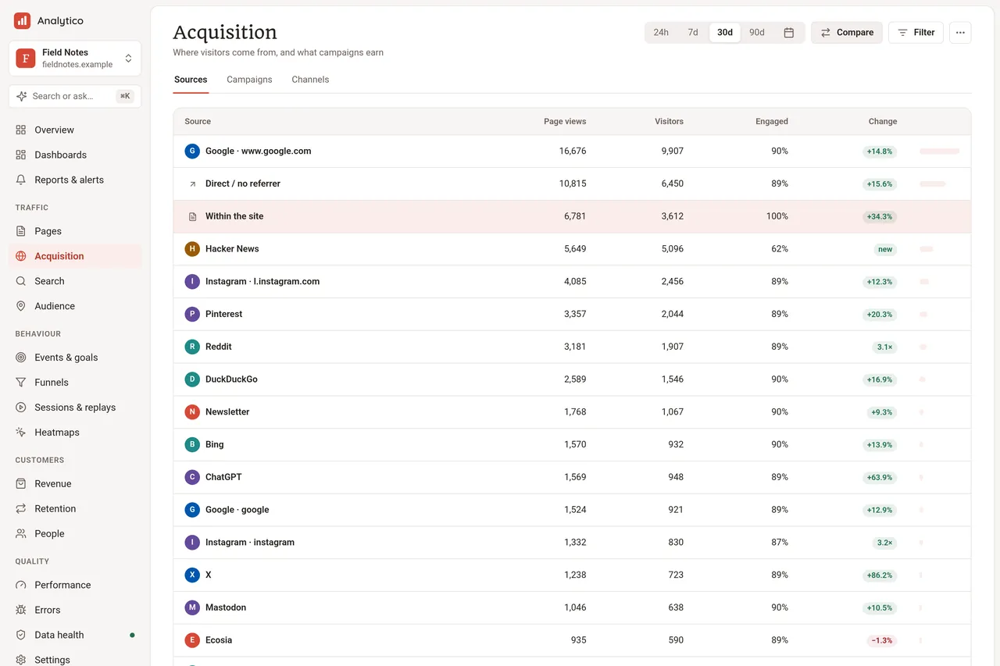
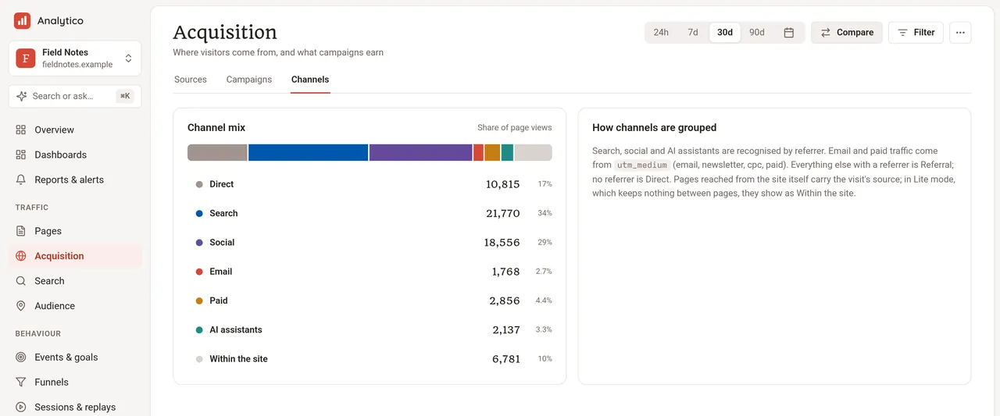


**A page.** Views, time, scroll, the sections people reached and where they
went next.

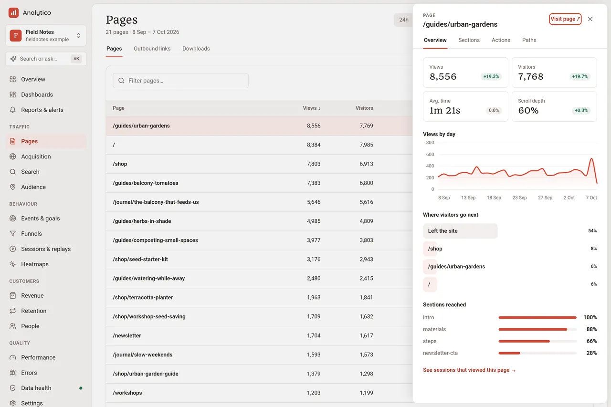

**Sessions, paths and a replay.** Text and inputs are masked in the
visitor's browser before anything is sent.

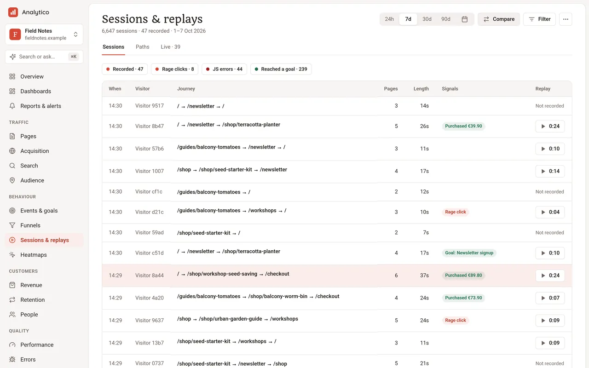
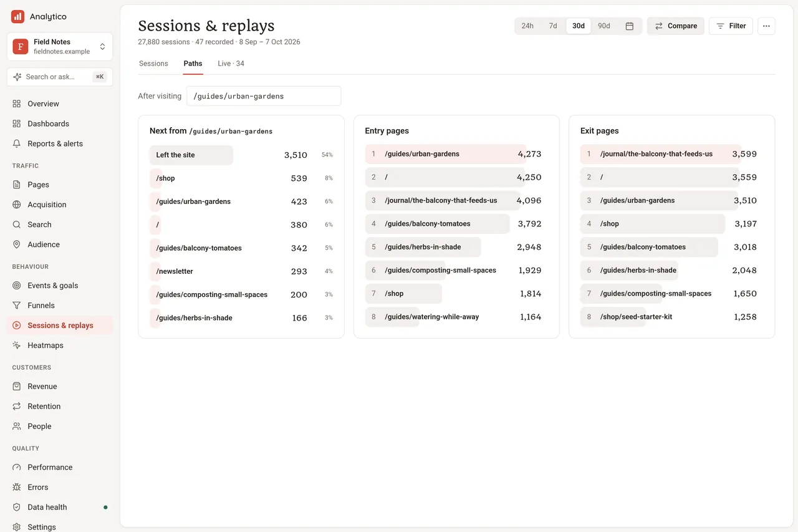


**Heatmap and funnel.**


**Errors.**


**Revenue and people.** Orders the shop's server confirmed, counted once,
credited to the visit they came from.

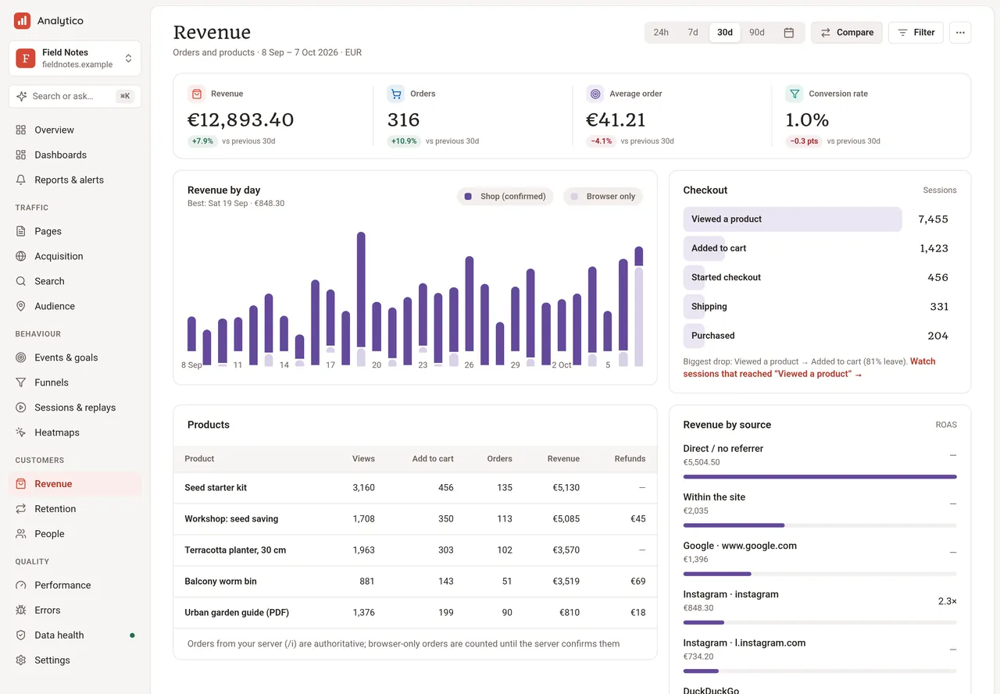
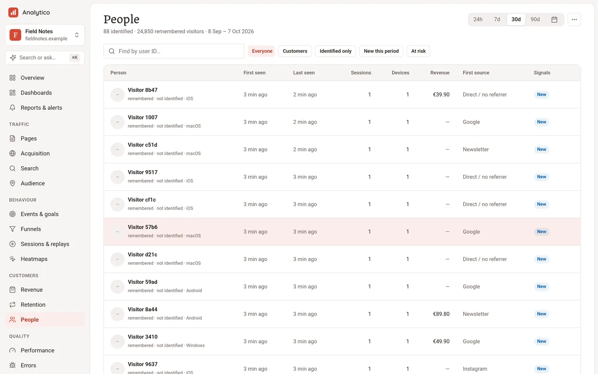
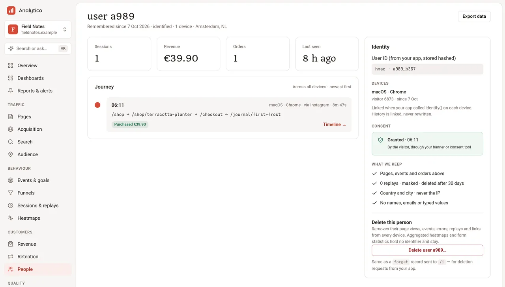

**Performance and data health.**

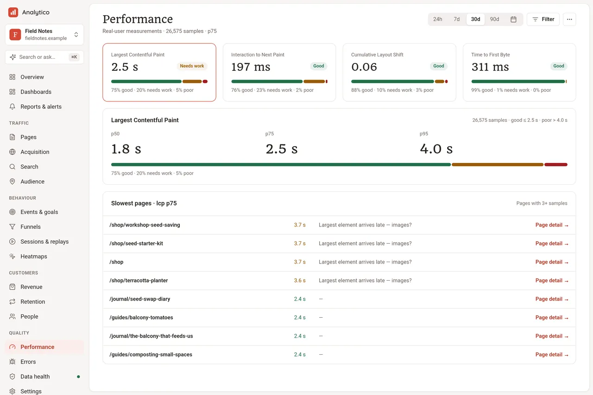
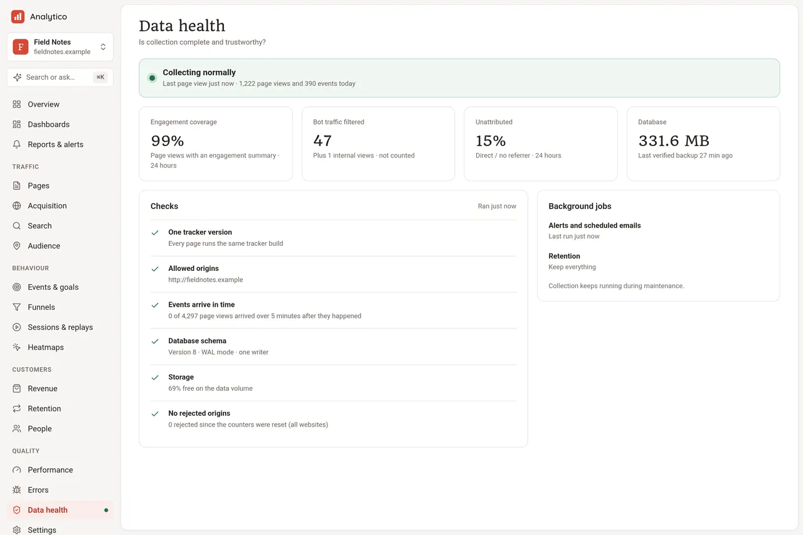

**Getting around, sharing, settings.**

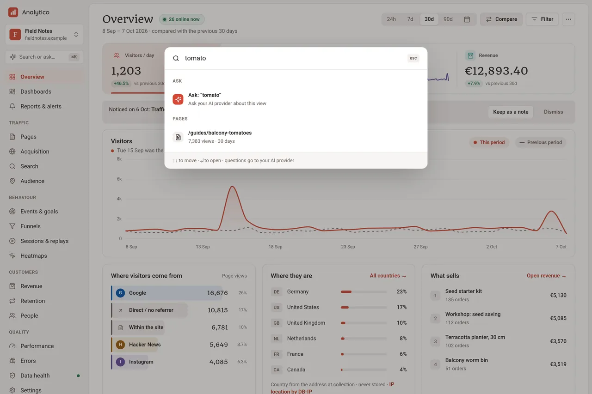
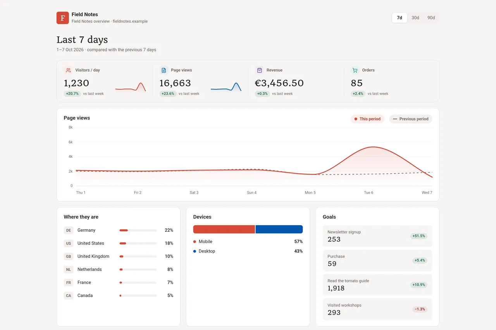
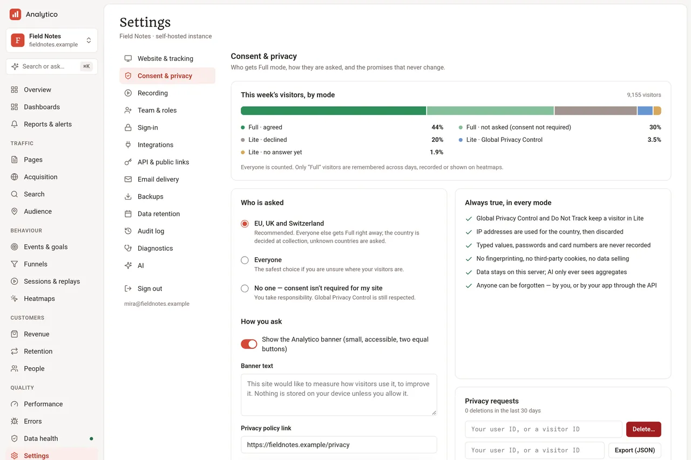

**Lite mode.** The second site stores nothing in the browser; the overview
still has sources, places, devices and engagement.

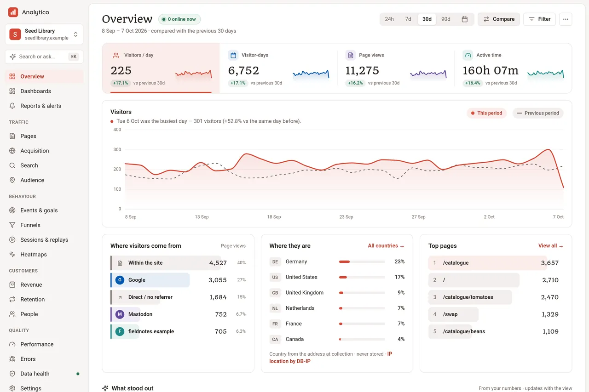

**On a phone.**


